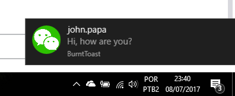

# Weechat Windows Notification



## Requirements
* Windows 10
* Powershell 5 or higher
* WeeChat running on bash (not cygwin)

## Instalation 
### 1- Install BurntToast

`Install-Module -Name BurntToast`

Execute the command after the BurntToast installation

`New-BTAppId`

### 2- Register PowerShell Script
```
git clone https://github.com/dzfweb/weechat-windows-notification
cd weechat-windows-notification
``` 

Edit the file WeeChatWindowsNotification.ps1 and replace the folder configuration. 
*Important: use a folder accessible both powershell and bash* 
```
$folder = 'C:\Users\dougl\.weechat'
```

Register the powershell script by running the following command on powershell 
```
WeeChatWindowsNotification.ps1
```

Create a shortcut to this powershell script as the following on windows startup folder. It is necessary to execute the script automatically when windows loaded.

```
%SystemRoot%\System32\WindowsPowerShell\v1.0\powershell.exe -windowstyle hidden -File C:\path\from\the\script\WeeChatWindowsNotification.ps1
```

### 3- Get WeeChat Windows Notification Plugin (windows bash)
Get the plugin script
```
wget https://raw.githubusercontent.com/dzfweb/weechat-windows-notification/master/windows_notification.py
cp windows_notification.py ~/.weechat/python/autoload
``` 
Start WeeChat and configure the path.

```/set plugins.var.python.windows_notification.path /mnt/c/Users/dougl/.weechat```

*Obs: you can set any folder, it is used to share temp files between powershell and bash only*

### Variables
Send notification for every highlight (default is on)
```
/set plugins.var.python.windows_notification.highlight on
```


Send notification for every query (default is on)
```
/set plugins.var.python.windows_notification.query on
```


Send notification even if is away (default is off)
```
/set plugins.var.python.windows_notification.notify_away on
```


### Reload PowerShell Script
Run the following command at the script plugin folders

```
Unregister-Event WeeChatWindowsNotification
WeeChatWindowsNotification.ps1

```

# Obs
You need to had set your default nickname for weechat: 
```
/set irc.server.freenode.nicks "mynick"
```